# mini-project-III
Repo with the instructions for the Mini Project III.

### Topics
This mini project is dedicated to following topics:
- Data Wrangling
- Data Visualization
- Data Preparation and Feature Engineering
- Dimensionality Reduction
- Unsupervised Learning

### Data
We will be using old data about different financial transactions. You can download the data from [here](https://drive.google.com/file/d/1zAjnf936aHkwVCq_BmA47p4lpRjyRzMf/view?usp=sharing). The data contains following tables:

- twm_customer - information about customers
- twm_accounts - information about accounts
- twm_checking_accounts - information about checking accounts (subset of twm_accounts)
- twm_credit_accounts - information about checking accounts (subset of twm_accounts)
- twm_savings_accounts - information about checking accounts (subset of twm_accounts)
- twm_transactions - information about financial transactions
- twm_savings_tran - information about savings transactions (subset of twm_transactions)
- twm_checking_tran - information about savings transactions (subset of twm_transactions)
- twm_credit_tran - information about credit checking (subset of twm_transactions)

### Output

In this miniproject, we will:

1.  create two separate customer segmentations (using clustering) to split them into 3-5 clusters: 
    - based on demographics (only on the information from twm_customer)
    - based on their banking behavior. We can take following things into consideration as banking behavior:
        - do they have savings account? How much do they save?
        - do they have credit account? How much do they live in debt?
        - are they making lot of small transactions or few huge ones?
2. visualize the created clusters using [radar charts](https://plotly.com/python/radar-chart/) and compare them agains each other
3. visualize segmentations using scatter plot. We will have to use PCA to be able to plot our observations in 2D.

----

# Workflow
To perform clustering on the given dataset and answer the questions, we need to follow these steps:

1. Merge the relevant data frames to obtain a unified view of customer demographics and banking behavior.
2. Perform feature engineering to prepare the data for clustering.
3. Carry out data preprocessing (Scaler --> PCA).
4. Perform clustering on the prepared data using the k-means/Agglomerative/DBSCAN algorithm.
5. Visualize the clusters using radar charts and scatter plots. 

---
# Feature Engineering
Note that some of the data frames contain redundant or unnecessary information, which can be dropped to simplify the analysis.

We conducted the following feature engineering tasks:

- Savings Account Balance: The balance of savings account (as saved).
- Credit Account Debt: The balance of credit account (as debt).
- Transaction Frequency: The number of days between transactions in the checking account, savings account, and credit account for each customer. 
- Mean Transaction Amount: The average transaction amount for each customer across all accounts.
- Median Transaction Amount: The median transaction amount for each customer across all accounts.
- Standard Deviation of Transaction Amount: The standard deviation of transaction amount for each customer across all accounts.
- Maximum Transaction Amount: The maximum transaction amount for each customer across all accounts.
- Minimum Transaction Amount: The minimum transaction amount for each customer across all accounts.
- Interquartile Range of Transaction Amount: The interquartile range of transaction amount for each customer across all accounts.

| Feature                | Checking Account | Savings Account | Credit Account |
|------------------------|------------------|-----------------|----------------|
| Savings Account Balance |                  | Balance of savings account (as saved)  |              |
| Credit Account Debt     |                  |                 | Balance of credit account (as debt) |
| Transaction Frequency   | Number of transactions in checking account | Number of transactions in savings account | Number of transactions in credit account |
| Mean Transaction Amount | Average transaction amount in checking account for each customer | Average transaction amount in savings account for each customer | Average transaction amount in credit account for each customer |
| Median Transaction Amount | Median transaction amount in checking account for each customer | Median transaction amount in savings account for each customer | Median transaction amount in credit account for each customer |
| Standard Deviation of Transaction Amount | Standard deviation of transaction amount in checking account for each customer | Standard deviation of transaction amount in savings account for each customer | Standard deviation of transaction amount in credit account for each customer |
| Maximum Transaction Amount | Maximum transaction amount in checking account for each customer | Maximum transaction amount in savings account for each customer | Maximum transaction amount in credit account for each customer |
| Minimum Transaction Amount | Minimum transaction amount in checking account for each customer | Minimum transaction amount in savings account for each customer | Minimum transaction amount in credit account for each customer |
| Interquartile Range of Transaction Amount | Interquartile range of transaction amount in checking account for each customer | Interquartile range of transaction amount in savings account for each customer | Interquartile range of transaction amount in credit account for each customer |

----

# Clustering by Geolocation

To investigate geolocation information in clustering, we converted the address-related columns to longitude and latitude using the Google Maps API. We used different distance concepts to calculate the distance. First, we compared the mean results with and without standard scaling. It shows that scaling is not always a good choice for geolocation clustering because it distorts the longitude and latitude values. 

  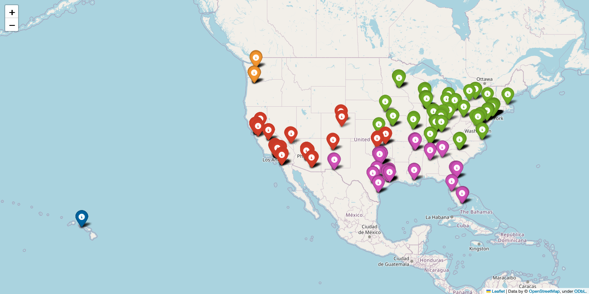
  
Customer Address Map - Geo Clustering with StandardScaler

  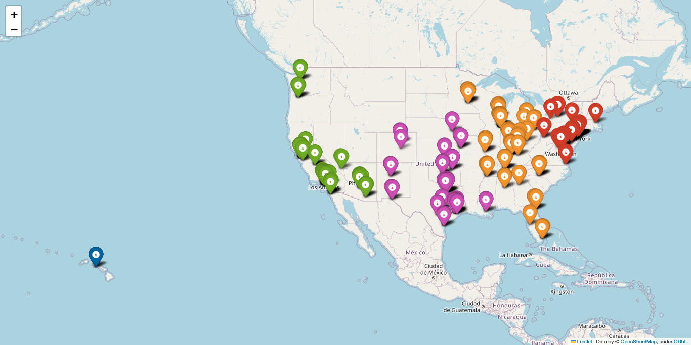
  
Customer Address Latitude and Longitude Map with Geographical Clustering - No Scaler

Furthermore, we compared the results of agglomerative clustering using the Euclidean and Haversine distance metrics.

  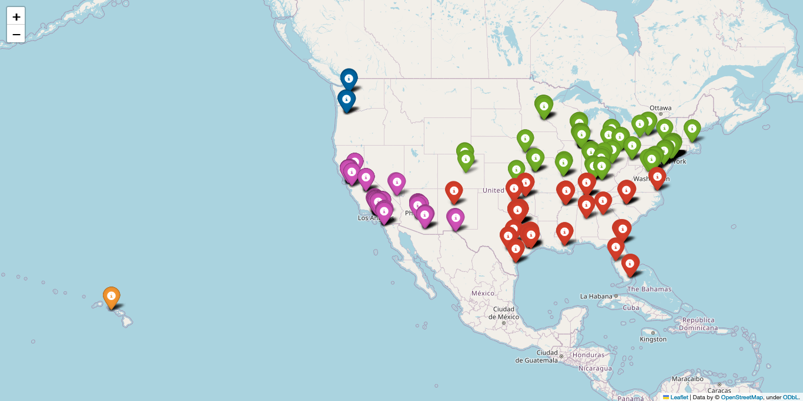
  
Customer Address Map - Agglomerative Clustering (Euclidean Distance)

  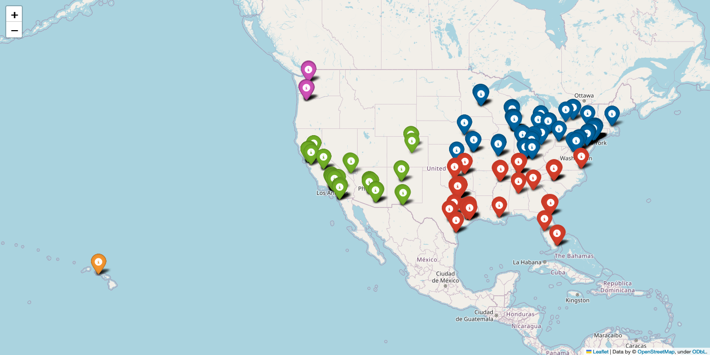
  
Customer Address Map - Agglomerative Clustering (Haversine Distance)

This comparison revealed that the Haversine distance is more accurate in clustering geolocations. The reason why Haversine distance is better for geolocation clustering is that it is specifically designed to measure distances between points on a sphere, such as the Earth's surface. This is important because longitude and latitude values represent points on a sphere, and using the Euclidean distance metric, which assumes a flat space, can lead to distorted clustering results when applied to geolocation data. Therefore, using the Haversine distance metric leads to more accurate clustering results for geolocation data.

----
## Data Insights - Geolocation
This table provides information on the distribution of customers across different geographical locations, represented by their longitude and latitude coordinates. The "number_of_customers_at_the_same_LL" column indicates the number of customers who have the same latitude and longitude coordinates, while the "number_of_unique_address_at_the_same_LL" column indicates the number of unique addresses that correspond to the same latitude and longitude coordinates.

It is important to note that the latitude and longitude values may imply the same office or residential building, while the address may imply multiple companies or several family members living at the same location.

Overall, this table provides insights into the distribution of customers across different geographical locations, which can be useful for identifying areas with high customer concentration or for geospatial analysis. The table can also be used to identify potential clustering patterns or trends in customer behavior based on their geographical location.

| latitude | longitude | number_of_customers_at_the_same_LL | number_of_unique_address_at_the_same_LL |
|---------|-----------|-----------------------------------|------------------------------------------|
| 40.71   | -74.01    | 25                                | 18                                       |
| 34.05   | -118.24   | 19                                | 15                                       |
| 21.31   | -157.86   | 9                                 | 3                                        |
| 45.52   | -122.68   | 8                                 | 2                                        |
| 37.77   | -122.42   | 7                                 | 4                                        |
| ...     | ...       | ...                               | ...                                      |
| 35.38   | -97.64    | 1                                 | 1                                        |
| 35.52   | -97.53    | 1                                 | 1                                        |
| 36.08   | -86.83    | 1                                 | 1                                        |
| 36.10   | -95.88    | 1                                 | 1                                        |
| 47.74   | -122.34   | 1                                 | 1                                        |

----
#  Interpreting Principal Component Analysis (PCA) Results

This table provides information on the contribution of different features to the first two principal components (PC1 and PC2) in a PCA analysis, using four different scaling methods (minmax, standard, maxabs, and robust). The values in each cell represent the percentage of variance explained by each feature for each principal component, which indicates the importance of the feature in the overall variability of the data.

| Scaler Name | PC1 Feature 1 | PC1 Feature 2 | PC1 Feature 3 | PC2 Feature 1 | PC2 Feature 2 | PC2 Feature 3 |
| --- | --- | --- | --- | --- | --- | --- |
| minmax | gender_indicator (99.84%) | CUST_income (5.15%) | longitude (1.49%) | CUST_marital_status (80.12%) | CUST_age (41.74%) | CUST_nbr_children (36.14%) |
| standard | CUST_marital_status (59.59%) | CUST_income (49.1%) | CUST_nbr_children (48.92%) | longitude (69.72%) | latitude (66.89%) | CUST_age (18.05%) |
| maxabs | gender_indicator (99.86%) | CUST_income (5.1%) | CUST_nbr_children (0.78%) | CUST_years_with_bank (94.53%) | CUST_age (29.23%) | CUST_marital_status (12.02%) |
| robust | CUST_nbr_children (75.14%) | CUST_marital_status (51.29%) | CUST_income (39.92%) | CUST_income (64.37%) | CUST_age (50.44%) | CUST_nbr_children (49.55%) |

Interpreting the table involves looking at the highest percentage values for each principal component and scaling method, which correspond to the features that have the strongest influence on the data variability. For example, in the minmax scaling method, the gender_indicator feature has the highest percentage value (99.84%) for PC1, indicating that it is the most important feature for explaining the variability in that component. Similarly, for the standard scaling method, the longitude and latitude features have the highest percentage values for PC2, indicating their importance in explaining the variability in that component.

Overall, interpreting this table can help identify which features are most important for explaining the variability in the data and can provide insights into potential patterns or trends in the data.

  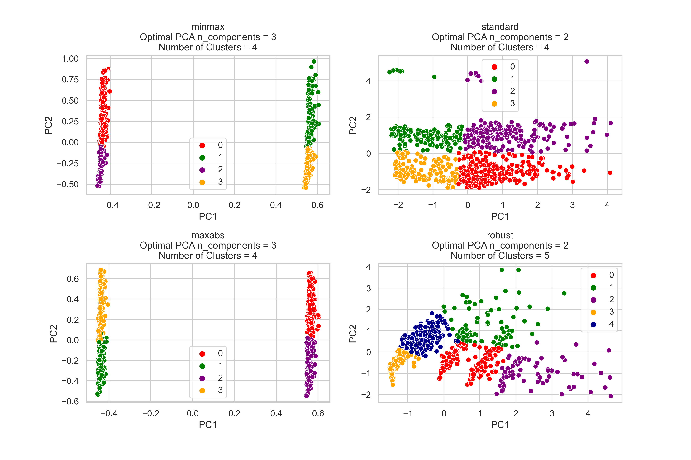
  
K-Means Clustering - PC1 and PC2 by Scalers

The choice of scalar can have a significant impact on the results of a clustering analysis. Different scalers can lead to different interpretations of the data, as they can emphasize or de-emphasize certain features. It is important to carefully consider which scalar to use, as it can affect the accuracy of the clustering and the insights gained from the analysis. For example, min-max scaling can be sensitive to outliers, while standard scaling can handle outliers but can also reduce the impact of small variations in the data. Choosing the right scalar requires careful consideration of the data and the goals of the analysis.

----

# Clustering by Banking Behavior
## K-Means Clustering

  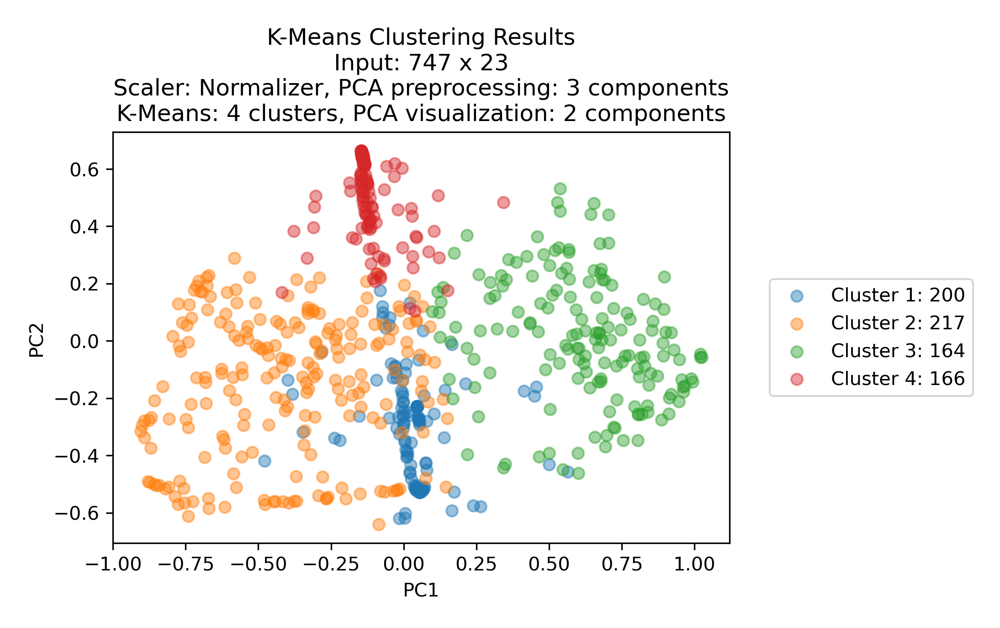
  
K-Means Clustering with Normalizer Scaler - PC1 and PC2 Visualization

From a 2D view, the data may appear twisted, but when it is projected into the 3D PCA space where clustering is performed, it will take on a different appearance. The cluster that is denoted by different colors aligns with our human observation. The difference in color is caused by the varying interpretation of the color map between matplotlib and plotly.

  
  
K-Means Clustering with Normalizer Scaler - PCA 3D Visualization

When interpreting the clustering results, we rely on the most important features contributing to the PCA axis. This information can be obtained from KMeans.components_. To create the radar chart, we chose six of the most significant features out of the 26 engineered features. We can observe the differences in banking behavior among different customer groups. In different analyses, the six features selected may vary due to the use of different feature engineering techniques, scaler selection, pre-processing methods, and clustering algorithms.

  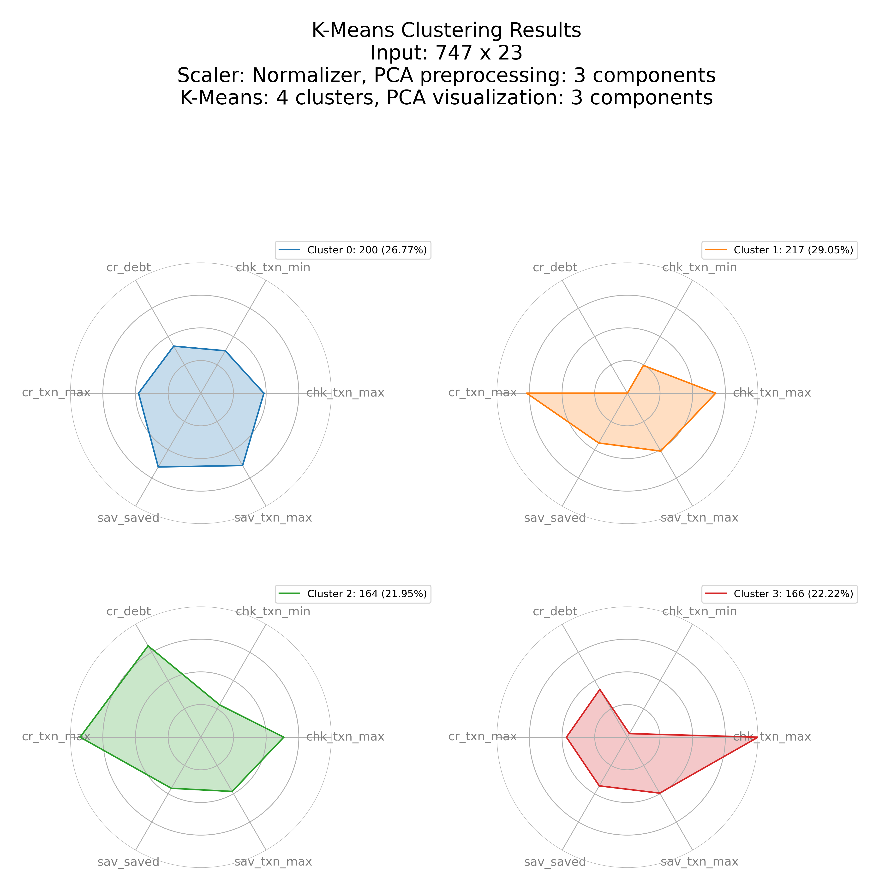
  
K-Means Clustering with Normalizer Scaler - Radar Chart Visualization of Important Features

From the radar chart, we can observe that the cluster of customers (blue) who spend money cautiously on credit cards and checking accounts tend to have more saved amounts. Meanwhile, there is a cluster of users (orange vs green) who have a high maximum value for credit card transactions but do not have much credit card debt. Perhaps they are only using credit cards to accumulate reward points.

## Agglomerative Clustering

  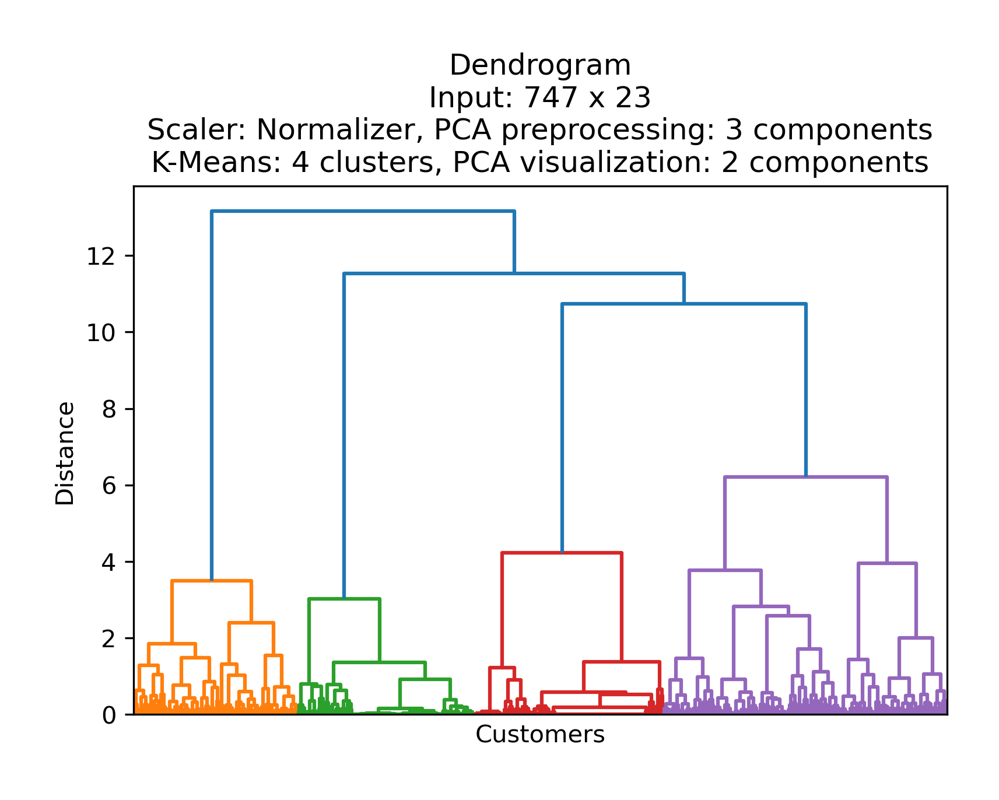
  
Hierarchical Agglomerative Clustering Dendrogram - Normalizer Scaler, 4 Clusters.

  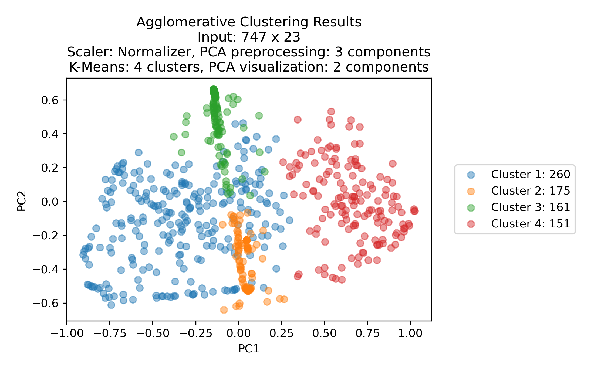
  
Agglomerative Clustering with Normalizer Scaler - PCA 2D Visualization

  
  
Agglomerative Clustering with Normalizer Scaler - PCA 3D Visualization

  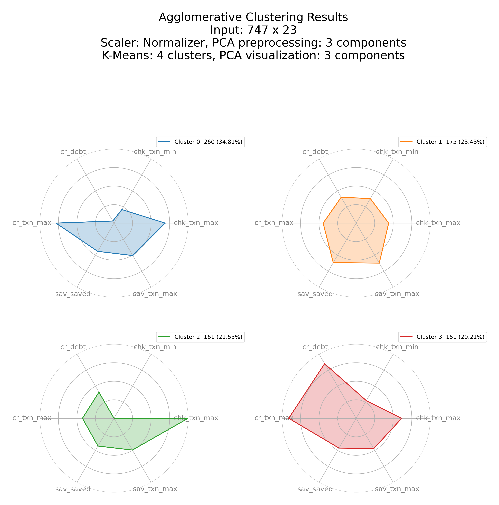
  
Agglomerative Clustering with Normalizer Scaler - Radar Chart Visualization of Important Features

Upon comparison, we found that KMeans and Agglomerative clustering yield similar clusters and visualizations for this dataset. We can see that there are two types of customers, one type (blue) prefers to use credit cards for transactions, while the other (green) prefers to use checking accounts. This may help identify potential target customer groups for future credit card promotions.

## DBSCAN Clustering

  
  
DBSCAN Clustering with Normalizer Scaler - PCA 3D Visualization

  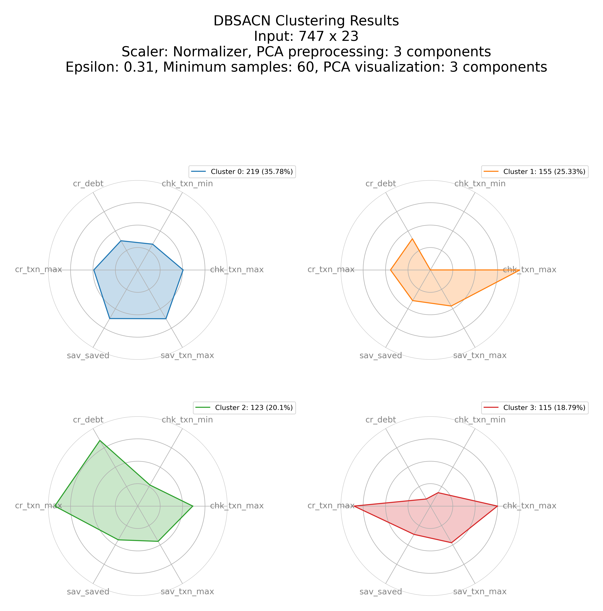
  
DBSCAN Clustering with Normalizer Scaler - Radar Chart Visualization of Important Features

----
# Scaler Comparison

Sometimes, the clustering results may not appear optimal when visualized in a 2D space, as demonstrated in this example:

  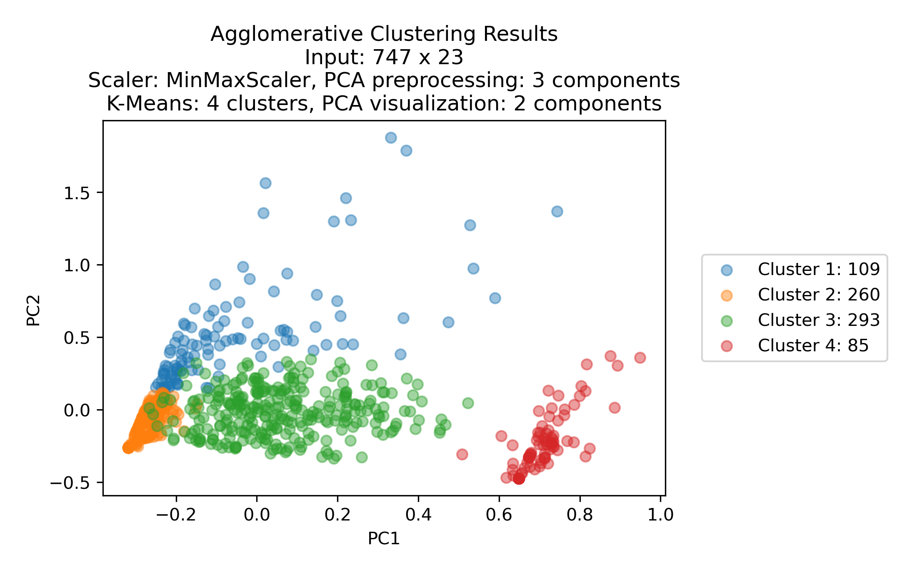
  
Agglomerative Clustering with MinMax Scaler - PCA 2D Visualization

Upon returning to the original 3D space, the clustering seems to be acceptable. However, upon closer inspection, it appears that the boundary between the blue and red clusters may not be as optimal as anticipated. It is noteworthy that we are currently using the MinMax scaler for this analysis.

  
  
Agglomerative Clustering with MinMax Scaler - PCA 3D Visualization

The radar chart below appears to be unusual compared to the others.

  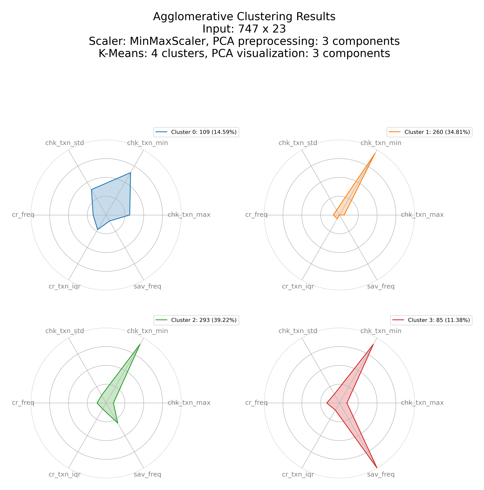
  
Agglomerative Clustering with MinMax Scaler - - Radar Chart Visualization of Important Features

If we try using another scaler, such as MaxAbs, we can see that it provides more reasonable results. This rationality can also be reflected in the radar chart.

  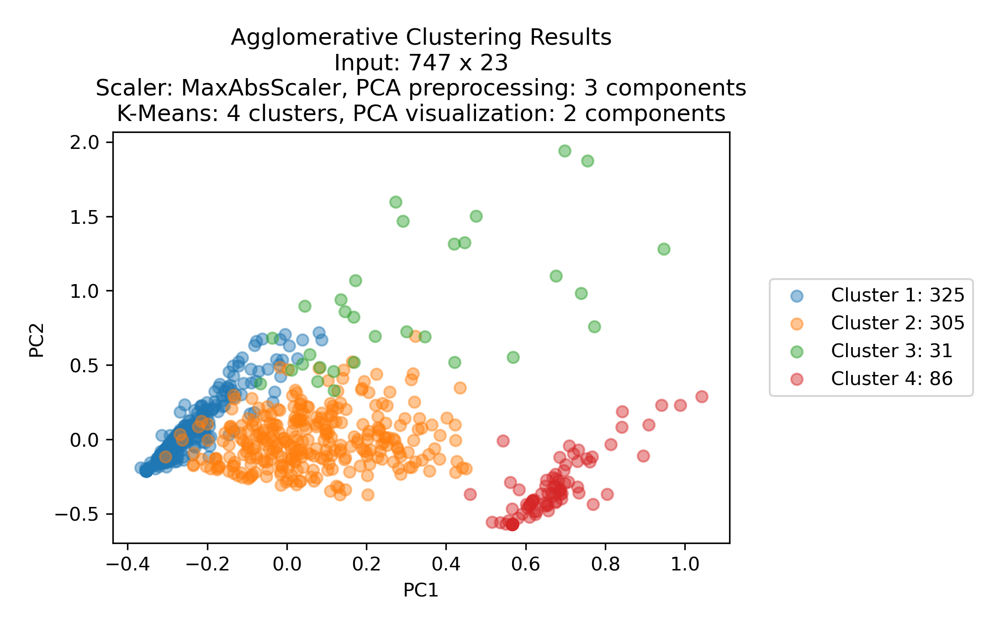
  
DBSCAN Clustering with MinMax Scaler - PCA 2D Visualization

  
  
DBSCAN Clustering with MinMax Scaler - PCA 3D Visualization

  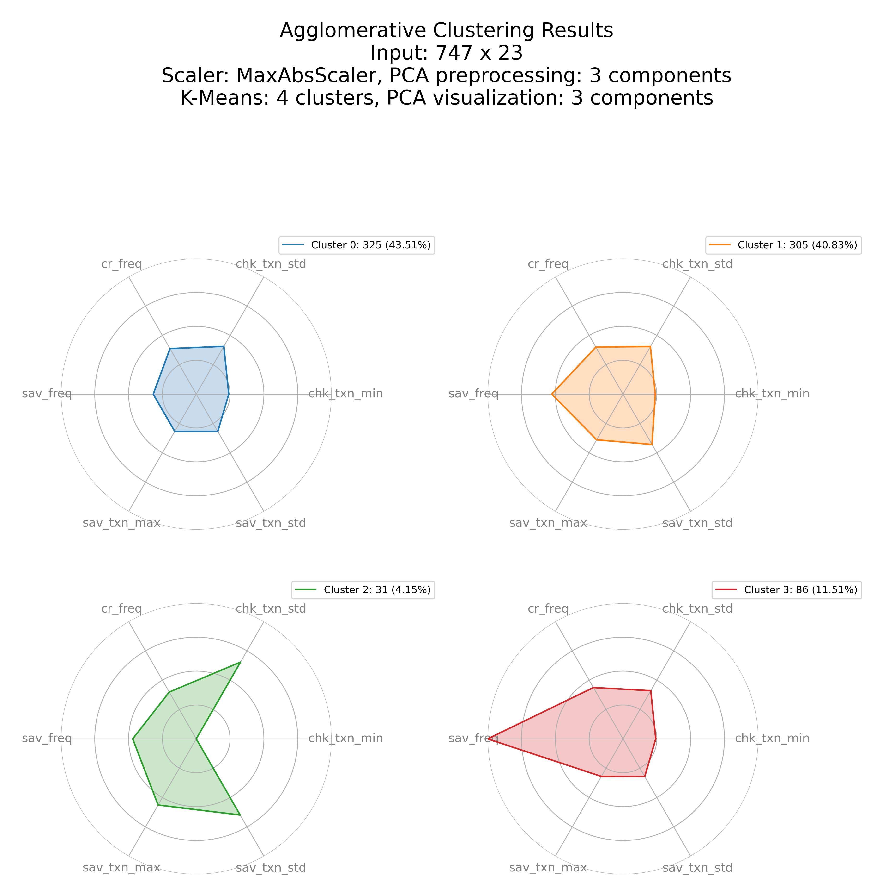
  
Agglomerative Clustering with MaxAbs Scaler - - Radar Chart Visualization of Important Features

# Conclusion:

* How does the applied feature engineering influence the impact of preprocessing scalers?
  * Feature engineering plays a crucial role in determining preprocessing scaler effectiveness. Skillfully engineered features amplify data patterns, simplifying scaler normalization tasks and leading to better clustering algorithm performance.

* How does the choice of preprocessing scaler influence the performance of clustering algorithms?
  * Clustering algorithm performance is significantly impacted by preprocessing scalers. Algorithms like K-means and DBSCAN rely on distance metrics, making them sensitive to feature scales. Using appropriate scalers, such as StandardScaler or MinMaxScaler, can normalize feature scales, ensuring equal contribution and improving clustering results.

# Reasons to remove outliers:
| Reason for Removing Outliers | Description |
| --- | --- |
| Human error | Outliers may result from human error during data collection or entry |
| Sampling error | Outliers may result from sampling error, such as an incorrect inclusion of data in the sample set |
| Nature of the data | Outliers may result from the nature of the data, but can provide misleading insights into the dataset |

# Insturctor-Recommended books/resourses:
| Resource                                                  | Description                                                                                         |
|---------------------|-----------------------------------------------------------|
| Cartoon Guide to Statistics by Larry Gonick and Woollcott Smith | A lighthearted, easy-to-read introduction to basic statistics concepts with illustrations and examples |
| StatQuest with Josh Starmer YouTube channel                | A series of easy-to-understand videos that cover a wide range of statistical topics, from basic concepts to advanced techniques |

